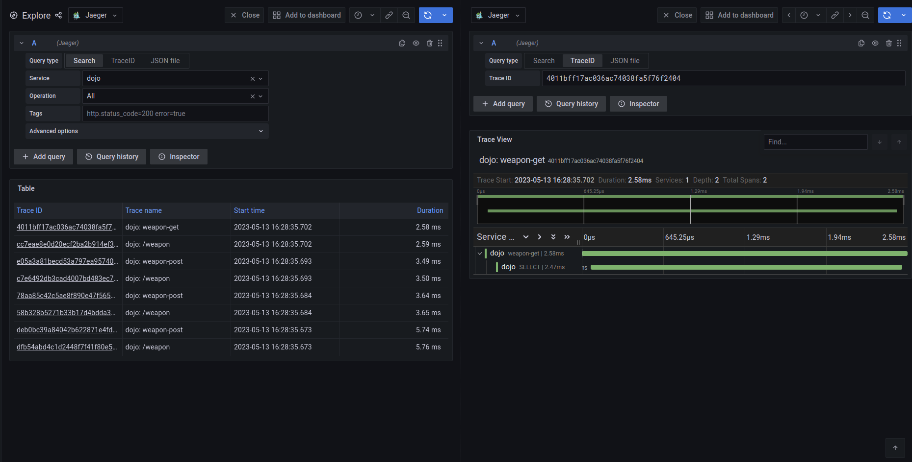
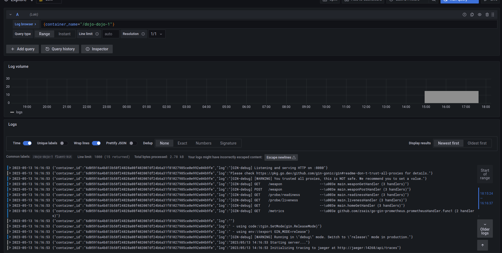
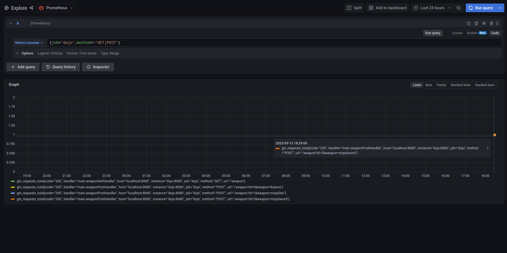

# Dojo

Application that manages weapons in dojo. Data are stored in relational database POSTGRES 13.

Build the image:
```shell
docker buildx build -t danijelradakovic/dojo \
  --target release-alpine \
  --build-arg SRC=cmd/dojo/main.go .
```

Building container images can also be achieved using docker compose:
```shell
docker compose --env-file env.conf build
```

Generate docker compose configuration with specified environment variables:
```shell
docker compose --env-file env.conf config
```

Provision the infrastructure:
```shell
docker compose --env-file env.conf up
```

Destroy the provisioned infrastructure:
```shell
docker compose --env-file env.conf down -v
```

Test the application:
```shell
curl -X POST "http://localhost:8080/weapon?id=0&weapon=katana"
curl -X POST "http://localhost:8080/weapon?id=1&weapon=ninjaStar"
curl -X POST "http://localhost:8080/weapon?id=2&weapon=ninjaSword"

curl "http://localhost:8080/weapon"

```

## Monitoring

Create the monitoring stack with docker compose:
```shell
pushd monitoring
docker compose up
popd
```

Take the IP address of fluent-bit container and replace the value of FLUENT_BIT_ADDRESS variable
in env.conf file:
```shell
docker network inspect monitoring
```

Create the application stack with docker compose:
```shell
docker compose --env-file env.conf up
```

### Tracing



### Logs



### Metrics

